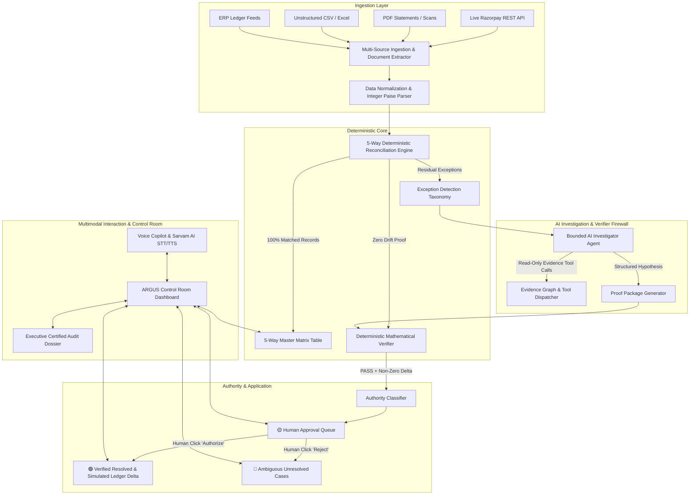
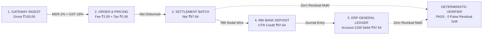
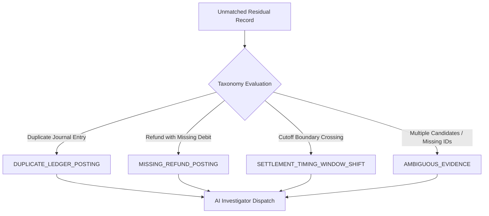
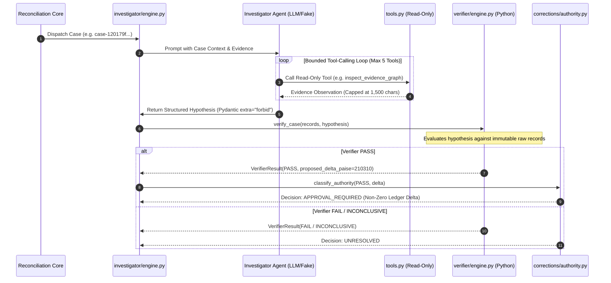
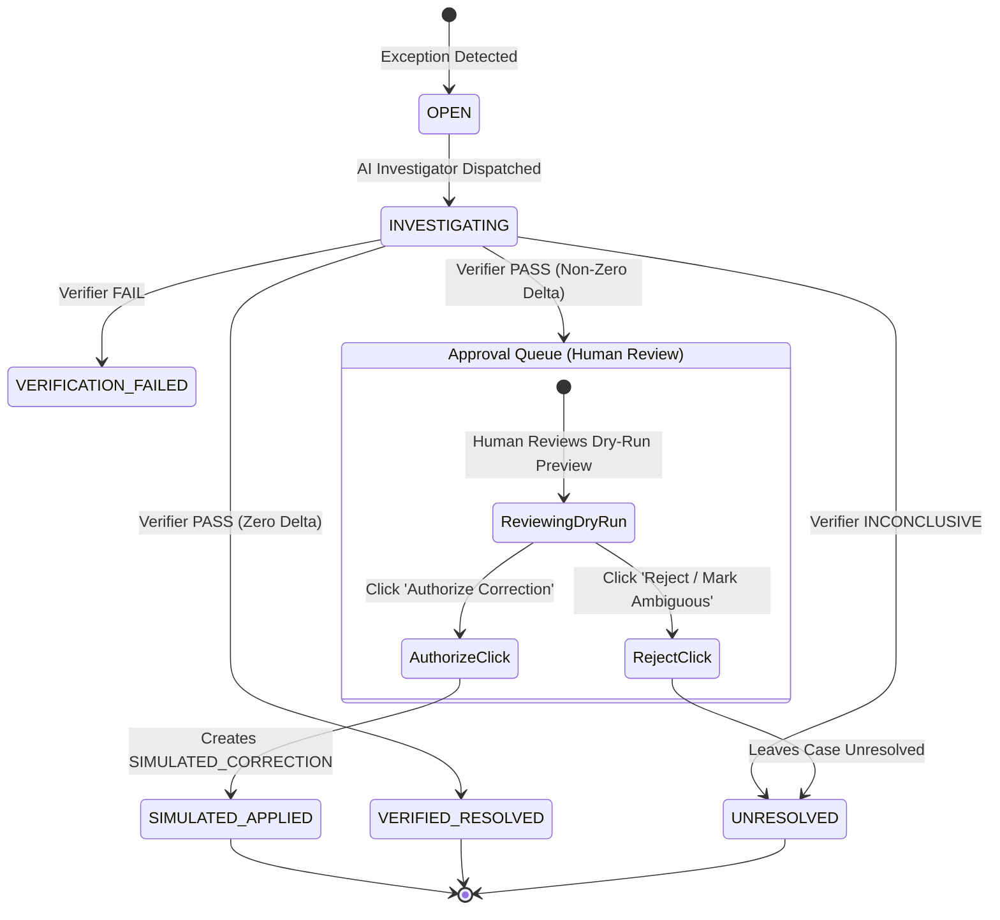
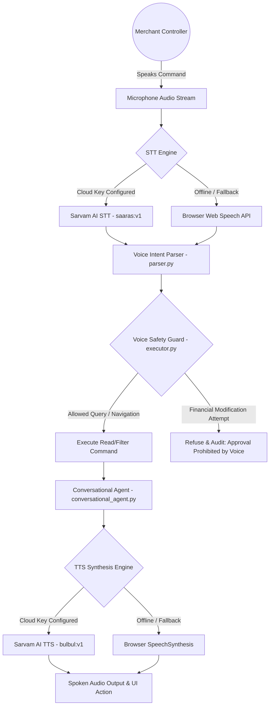
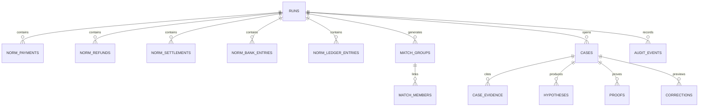
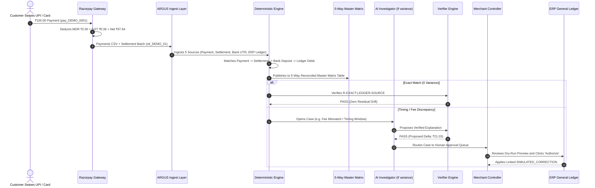

# ARGUS CONTROL — Complete Architectural & Information Flow Specification
**Financial Flight Recorder for Merchant Reconciliation (Razorpay AI Buildathon 2026, Track 04)**
*Commit Reference: `a4a64e1645b9b35fca51825ff3ba31ae85213865`*

> Historical architecture reference for the commit above, not a current feature
> inventory or a governing specification. Its OCR/PDF and live-gateway descriptions
> are superseded by the current CSV-only, Test Mode intake. See
> [the September 3 checkpoint](docs/checkpoints/2026-09-03-intake.md) for supported
> behaviour, verification and remaining limitations. The PRD remains authoritative.

---

## 1. Executive Summary & Product Philosophy

**ARGUS CONTROL** is an enterprise-grade financial flight recorder designed for multi-source merchant payment reconciliation. It deterministically reconciles synthetic payments, refunds, settlement batches, bank nodal statements, and ERP general ledgers, using a bounded AI investigator strictly for residual exceptions, deterministic verifiers for proof verification, dry-run ledger simulations, and mandatory human sign-off for financial authority.

```
       ┌────────────────────────────────────────────────────────┐
       │                   ARGUS CORE TENET                     │
       │  "Rules for calculation, AI for investigation,        │
       │   verification for closure, approval for authority,    │
       │   humans for ambiguity."                               │
       └────────────────────────────────────────────────────────┘
```

### Absolute Financial Invariants
1. **Integer Paise Arithmetic**: INR money is signed **integer paise** ($1\text{ INR} = 100\text{ paise}$). Binary floating-point arithmetic is strictly rejected (`app.domain.money.require_paise` rejects `float` and `bool` values). Decimal strings are parsed with exact string math (`0.00000000000000` float drift).
2. **UTC & Accounting Time Separation**: Event timestamp (`captured_at_utc`), settlement window (`settled_at_utc`), import timestamp, and accounting date (`accounting_date`) remain strictly distinct.
3. **Immutable Source Row Integrity**: Raw source rows are immutable. Normalized rows store a backward pointer and SHA-256 content hash to their original raw row.
4. **Append-Only Cryptographic Audit Logs**: All state transitions, AI investigations, human approvals, and simulated applications emit cryptographic SHA-256 hashed audit events.
5. **No Silent Drops**: Malformed or unparseable input rows are quarantined with reason codes; they are never silently ignored.
6. **Zero Autonomous Financial Writes**: The AI model **never** calculates authoritative totals, **never** marks cases resolved, and **never** writes financial tables. There is no model-callable `approve`, `apply`, or `update_ledger` tool.
7. **Human Authority Required**: Every non-zero ledger correction requires explicit human approval in the **Approval Queue**. Application only creates a new linked `SIMULATED_CORRECTION` entry — imported records are never edited.

---

## 2. High-Level System Architecture & Component Topology



---

## 3. The 5 Financial Ingestion Streams

ARGUS continuously ingests and normalizes 5 distinct financial streams:

| Stream | Entity Type | Primary ID | Key Fields | Normalization Target |
|---|---|---|---|---|
| **1. Gateway Payments** | `PAYMENT` | `payment_id` | `gross_amount`, `fee_amount`, `tax_amount`, `captured_at_utc`, `order_id`, `settlement_id` | `norm_payments` |
| **2. Gateway Refunds** | `REFUND` | `refund_id` | `payment_id`, `refund_amount`, `created_at_utc`, `settlement_id`, `status` | `norm_refunds` |
| **3. Gateway Settlements** | `SETTLEMENT` | `settlement_id` | `gross_credit`, `fee_amount`, `tax_amount`, `net_amount`, `utr`, `window_start_utc`, `window_end_utc` | `norm_settlements` |
| **4. Bank Statements** | `BANK_ENTRY` | `bank_entry_id` | `posted_at_utc`, `value_date`, `signed_amount`, `narration`, `utr`, `account_fingerprint` | `norm_bank_entries` |
| **5. ERP General Ledger** | `LEDGER_ENTRY` | `ledger_entry_id` | `account_code`, `accounting_date`, `signed_amount`, `source_reference`, `entry_origin` | `norm_ledger_entries` |

### Multi-File Collision-Safe Stacking Pipeline (`_merge_and_save_csv`)
When multiple data sources are uploaded (e.g. Live Razorpay API sync + PDF statement + CSV ledger), ARGUS merges and stacks the records:
1. Deduplicates or suffixes colliding IDs (e.g. `pay_DEMO_0001` $\rightarrow$ `pay_DEMO_0001_imp2`) to avoid quarantine drops.
2. Accumulates datasets from 500 to 1,000+ to 5,000+ records to stress-test high-throughput reconciliation (**4,400+ records/second**).

---

## 4. Multimodal Document Extraction & Live Sync Engine

ARGUS features a document ingestion subsystem located in `backend/app/importers/`:

```mermaid
sequenceDiagram
    autonumber
    actor Merchant as Merchant / Controller
    participant UI as Control Room UI
    participant Router as routes_ingest.py
    participant Extractor as document_extractor.py
    participant Sandbox as sandbox_runner.py
    participant DB as SQLite Storage

    Merchant->>UI: Uploads PDF / Bank Statement / CSV
    UI->>Router: POST /api/v1/ingest/stream-extract (SSE Stream)
    Router->>Sandbox: Initialize isolated Python extraction sandbox
    Sandbox-->>UI: Event: TASK_STARTED (Reading document layout)
    Sandbox->>Extractor: extract_financial_data_from_document()
    Extractor->>Extractor: OCR Vision Table Detection & Header Normalization
    Sandbox-->>UI: Event: STDOUT ("Extracted 520 rows; mapped columns [Date, UTR, Amount]")
    Sandbox-->>UI: Event: TASK_COMPLETED (Canonical CSV generated)
    UI->>Router: POST /api/v1/ingest/commit-extracted
    Router->>DB: Persist staged normalized CSV in session directory
```

### Multimodal Vision & OCR Extractor (`document_extractor.py`)
* Extracts tabular transaction records from scanned PDFs and images.
* Recognizes Indian banking narrations (e.g., `CMS/RZP/STL_001/HDFC0001`, `NEFT-UTR-123456789012`).
* Maps proprietary headers (`Txn Amount`, `Credit Date`, `Reference No.`, `MDR Charge`) into standard schema fields (`gross_amount`, `posted_at_utc`, `utr`, `fee_amount`).

### Python Sandbox Execution Engine (`sandbox_runner.py`)
* Runs code generation and verification in an isolated execution sandbox.
* Streams live task status checklists and terminal STDOUT directly to the frontend via Server-Sent Events (`text/event-stream`).

---

## 5. Deterministic 5-Way Reconciliation Engine

The reconciliation engine (`backend/app/reconciliation/`) computes deterministic matches across all 5 financial pillars:



### Deterministic Matching Rules:
1. **`R-EXACT-LEDGER-SOURCE`**: 1-to-1 exact match linking a Gateway Payment to its ERP General Ledger journal entry via `order_id` / `source_reference` and exact signed integer paise amount.
2. **`R-UTR-AMOUNT-BANK`**: 1-to-1 exact match linking a Gateway Settlement payout batch to the Bank Statement nodal deposit via the unique RBI UTR number and net amount paise.
3. **`R-BATCH-PAYMENT-SETTLEMENT`**: Many-to-1 mathematical aggregation verifying that the sum of gross payments minus gateway fees and taxes strictly equals the settlement batch net credit.
4. **`R-REFUND-REVERSAL`**: 1-to-1 match linking a customer refund reversal back to the parent captured payment.
5. **`R-LEDGER-NET-DISBURSEMENT`**: Verifies that the net bank payout matches the total debited to ledger account `2100-MERCHANT-SETTLEMENT`.

### Integer Paise Exact Arithmetic
$$\text{Gross Paid } (₹100.00) - \text{MDR Fee } (₹2.00) - \text{GST Tax } (₹0.36) = \text{Net Settled } (₹97.64)$$
$$\text{Floating-Point Error} = 0.00000000000000 \quad (\text{Exact Integer Paise: } 10000 - 200 - 36 = 9764)$$

---

## 6. Exception Detection Taxonomy & Quarantine Architecture

When records do not match deterministically, the exception detector (`detectors.py`) classifies the discrepancy under a frozen 4-category taxonomy (PRD §4.2):



### Quarantine Engine:
* If an incoming CSV row has invalid syntax, corrupted encodings, or missing required fields, it is stored in `quarantined_records`.
* Quarantined records preserve their source row number and content hash.
* Zero rows are dropped silently.

---

## 7. Bounded AI Investigator & Verifier Firewall

For residual exception cases, ARGUS dispatches an isolated AI Investigator (`backend/app/investigator/`):



### AI Investigator Security Guarantees:
* **No Mutation Tools**: The agent only has access to read-only tools (`search_records`, `get_record_details`, `inspect_evidence_graph`, `check_settlement_window`).
* **Pydantic Validation**: All outputs are parsed with `extra="forbid"`. AI confidence scores or narrative status overrides are structurally impossible.
* **Deterministic Code Verification**: Every proposed hypothesis is verified by independent Python code (`verify_case`). The AI suggests; deterministic code verifies.

---

## 8. Human Authority Workflow & Simulated Corrections



### Dry-Run Ledger Previews (`dry_run.py` & `application.py`):
1. When a case is classified as `APPROVAL_REQUIRED`, a dry-run journal preview is computed showing the exact debit/credit adjustments.
2. In the **Human Approval Queue**, the merchant controller inspects the dry-run delta, AI investigation log, and cited evidence IDs.
3. Clicking **`Authorize Correction`**:
   - Emits an append-only `CORRECTION_AUTHORIZED` audit log.
   - Inserts a new `SIMULATED_CORRECTION` row in `norm_ledger_entries` (the original imported rows remain untouched).
   - Transitions the case status to `SIMULATED_APPLIED` / `VERIFIED_RESOLVED`.

---

## 9. Multimodal Voice Architecture & Sarvam AI Integration

ARGUS incorporates a conversational voice interface (`backend/app/voice/`):



### Voice Capabilities & Safety Properties:
* **Supported Languages**: English (`en-IN`), Hindi (`hi-IN`), and regional Indian language support.
* **Strict Voice Firewall**: Voice commands can filter cases, inspect dossiers, query throughput, and trigger reconciliations, but **VOICE CAN NEVER APPROVE OR APPLY FINANCIAL CORRECTIONS**. Approvals require manual human confirmation in the dashboard.

---

## 10. Frontend Control Room & Visual Trace Architecture

The frontend is built on Next.js 15 App Router, React, strict TypeScript, and Tailwind CSS (`frontend/src/`):

### 1. 5-Way Reconciled Master Matrix Table (`master-matrix-table.tsx`)
* Side-by-side tabular view displaying all 520 matched records:
  `Payment ID` | `Order ID` | `Gross / Fees` | `Net Ledger` | `Settlement Batch` | `Bank UTR Deposit` | `ERP Journal` | `Trace Graph ➔`
* Includes client-side pagination (25 / 50 / 100 per page) and instant search.

### 2. 5-Pillar Architectural Trace Graph Modal (`TraceGraphModal`)
* **Subtle Grid SVG Canvas**: High-contrast, dot-grid canvas (`backgroundSize: "36px 36px"`).
* **5 Interactive Pillars**:
  1. `1. GATEWAY INGEST` (Gross paid, timestamp, payment reference)
  2. `2. ORDER & PRICING` (MDR 2% + GST 18% fee calculation)
  3. `3. SETTLEMENT BATCH` (Net disbursed batch ID, settlement window)
  4. `4. RBI NODAL WIRE` (Interbank cleared UTR deposit)
  5. `5. ERP GENERAL LEDGER` (Double-entry journal debit, Account 2100)
  6. `DETERMINISTIC MATHEMATICAL VERIFIER` (PASS · 0 Paise Residual Drift)
* **Animated Flow Packet**: Pure SVG `<animateMotion>` energy particle traveling smoothly along the 5 nodes into the verifier box.
* **Interactive Deep Inspector**: Clicking any pillar node dynamically displays its raw IDs, timestamps, and hashes.
* **3-Tab Switcher**:
  - `Visual Trace`: The animated SVG flow canvas.
  - `Exact Math`: Step-by-step arithmetic equation showing 0.00000000000000 floating error.
  - `Proof JSON`: Statutory cryptographic proof certificate with 1-click copy.

---

## 11. Database Schema & Persistence Layer

All persistence is managed via SQLite (`backend/app/persistence/`):



### Table Definitions:
* `runs`: Master batch execution metadata, timing, match rates, and economic output hash.
* `norm_payments`, `norm_refunds`, `norm_settlements`, `norm_bank_entries`, `norm_ledger_entries`: Normalized 5-stream records with integer paise amounts and source row hashes.
* `match_groups` & `match_members`: Deterministic reconciliation matches and contributing record links.
* `cases` & `case_evidence`: Discrepancy cases, categories, variance paise, and evidence pointers.
* `hypotheses` & `proofs`: AI investigator hypotheses, mathematical verifier outcomes, and cryptographic proofs.
* `corrections`: Dry-run previews and applied simulated ledger entries.
* `audit_events`: Append-only cryptographic audit timeline.

---

## 12. End-to-End Information Flow (Single Transaction Trace)



---

## 13. Chronological Development & Milestones (up to `a4a64e1`)

| Commit | Description | Key Modules Implemented |
|---|---|---|
| `5813ca4` | Backend voice service architecture & Pydantic models | `backend/app/voice/api.py`, `schemas.py`, `service.py` |
| `38b0aac` | Conversational financial copilot agent | `backend/app/voice/conversational_agent.py`, `prompt.py` |
| `410be24` | Multi-session chat interface with voice integration | `frontend/src/components/voice-bar.tsx`, `copilot-chat.tsx` |
| `b1269ba` | ARGUS control room dashboard & case management | `frontend/src/app/dashboard/page.tsx`, `case-workspace.tsx` |
| `abb3179` | Fee audit, executive dossier & CSV ingestion extensions | `backend/app/api/routes_ingest.py`, `dossier_modal.tsx` |
| `1b03c84` | Chat session persistence & Razorpay API routing | `backend/app/api/routes_chat.py`, `routes_razorpay.py` |
| `0d53007` | Dataset connection modal & document extraction pipeline | `frontend/src/components/connect-dataset-modal.tsx` |
| `ded9bdb` | Razorpay API sync & automated extraction tools | `backend/app/importers/razorpay_client.py` |
| `8745c92` | Backend CSV/document ingestion & sandbox runner | `backend/app/importers/sandbox_runner.py`, `document_extractor.py` |
| `a4a64e1` | Voice API infrastructure, Sarvam AI STT/TTS & frontend controls | `backend/app/voice/transcribe.py`, `speech.py`, `voice-modal.tsx` |

---

## 14. Summary of Verification & Phase Gate Status

* **Deterministic Tests**: **350 / 350 backend unit tests passed** in pytest.
* **Type Safety**: **0 TypeScript errors**, strict Pydantic v2 validation across all endpoints.
* **Lint & Code Style**: **0 ESLint errors**, **139 Python files formatted with Ruff**.
* **Authoritative Gate**: `python scripts/verify_phase.py --phase 0` $\longrightarrow$ **`status=PASS`**.
