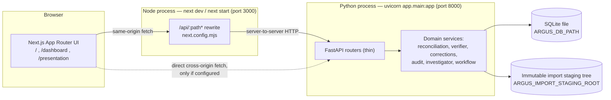
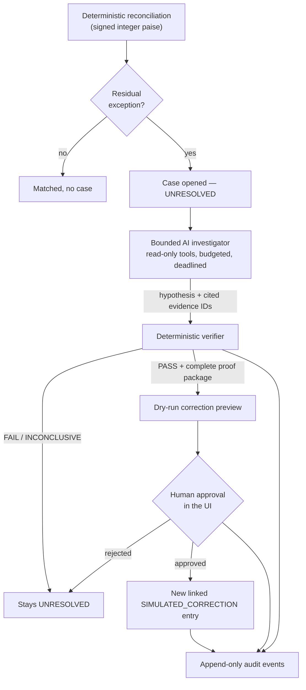

# ARGUS CONTROL — Architecture

Implementation documentation for the code in this repository as it exists on
the current working tree. Nothing here describes planned infrastructure. The
governing specifications remain
[`ARGUS_CONTROL_PRD.md`](../ARGUS_CONTROL_PRD.md),
[`ARGUS_CONTROL_MASTER_PROMPT.md`](../ARGUS_CONTROL_MASTER_PROMPT.md) and
[`README_ARGUS_CONTROL.md`](../README_ARGUS_CONTROL.md); this file explains how
the code implements them.

Related: [`data-flow.md`](data-flow.md),
[`security-and-deployment.md`](security-and-deployment.md),
[`reconciliation_rules.md`](reconciliation_rules.md),
[`verification_rules.md`](verification_rules.md),
[`investigator_rules.md`](investigator_rules.md),
[`data_dictionary.md`](data_dictionary.md).

## 1. Process and storage boundaries

There are exactly two long-running processes and two persistent paths. There is
no queue, cache server, object store, container orchestrator, or second
database.

- The browser normally talks only to the Next.js origin. `/api/:path*` is
  rewritten to the backend at **build time** (`frontend/next.config.mjs`), so
  the ordinary path is server-to-server and carries no `Origin` header.
- A direct browser-to-backend call is possible and is governed by the validated
  CORS policy in `backend/app/cors.py`. The default policy allows only the
  local development frontend and the isolated Playwright frontend port.

## 2. Backend module map

| Layer | Location | Responsibility |
| --- | --- | --- |
| Configuration | `backend/app/config.py`, `backend/app/cors.py` | Settings with safe local defaults; persistence-path and browser-origin validation. |
| HTTP | `backend/app/api/*`, `backend/app/voice/api.py`, `backend/app/ai/router.py` | Thin routers. No financial arithmetic. |
| Ingest / intake | `backend/app/importers/*` | CSV canonicalization, quarantine, immutable revisions, atomic activation, Razorpay Test Mode read client. |
| Reconciliation | `backend/app/reconciliation/*`, `backend/app/graph/*` | Deterministic matching and the evidence graph. |
| Investigation | `backend/app/investigator/*`, `backend/app/ai/*` | One bounded AI investigator over read-only tools. |
| Verification | `backend/app/verifier/*` | Deterministic falsification and proof packages. |
| Corrections | `backend/app/corrections/*` | Dry-run previews, approval authority, simulated application. |
| Audit | `backend/app/audit/*` | Append-only audit events. |
| Orchestration | `backend/app/runs.py`, `backend/app/workflow/controller.py` | Run identity, idempotency, durable progress. |
| Evaluation | `backend/app/evaluation/*` | Benchmark evaluator; evaluator-only label access. |
| Persistence | `backend/app/persistence/*` | The only place a SQLite connection is opened. |

## 3. Authority model

The product principle is *rules for calculation, AI for investigation,
verification for closure, approval for authority, humans for ambiguity*. It is
enforced structurally, not by prompt text:

Structural guarantees implemented in code:

- The model has **no** callable `approve`, `apply`, `update_ledger` or
  `mark_resolved` tool. Its tool allowlist is read-only evidence retrieval.
- A case can leave `UNRESOLVED` only through a deterministic verifier `PASS`
  with cited evidence IDs and rule versions.
- Imported rows are immutable. A correction only ever creates a **new** linked
  simulated entry.
- Audit events are append-only.
- Money is signed integer paise throughout (`app.domain.money`); binary floats
  are rejected at the boundary.

## 4. Frontend

Next.js App Router with strict TypeScript and Tailwind. Three routes exist:
`/`, `/dashboard` (the control room) and `/presentation`. Components render API
results; they contain no financial truth logic. Voice is a read-only copilot —
it can navigate and query, and every approval/apply/override phrasing is
refused by the deterministic guardrails before execution.

## 5. Deliberate non-dependencies

PostgreSQL, Redis, S3, Celery, message queues, microservices, Kubernetes, chat
or bot channel SDKs, and any vector/RAG store are **not** used. SQLite plus a
filesystem staging tree is the whole persistence story, which is what makes the
fresh-clone and restart contracts in
[`security-and-deployment.md`](security-and-deployment.md) provable offline.
