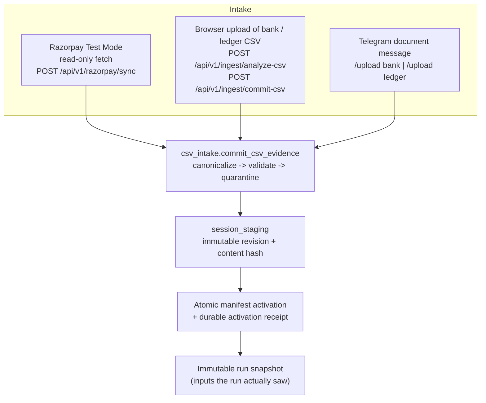
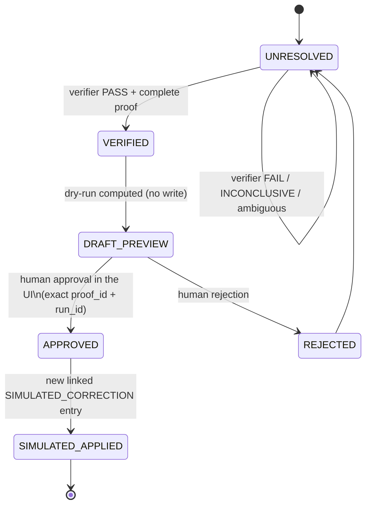
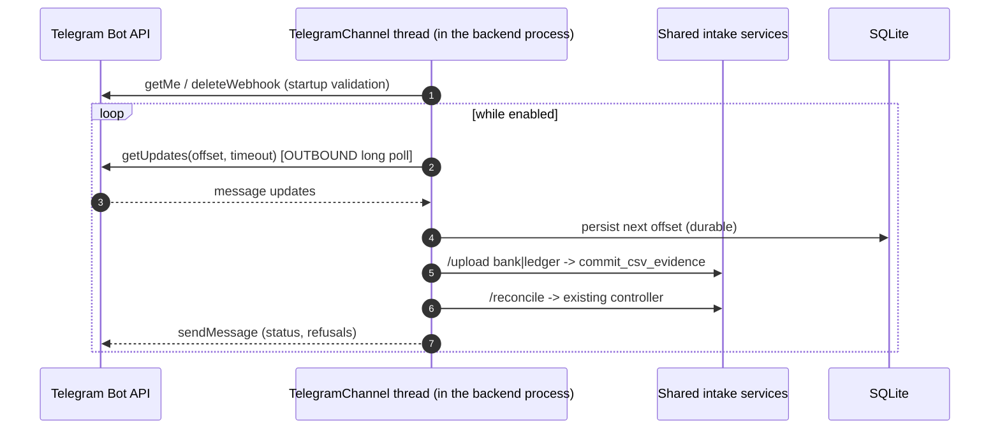

# ARGUS CONTROL — Data Flow

How financial evidence enters ARGUS, how it becomes a reconciliation result,
and where it stops. Every path described here exists in the current code.

Related: [`architecture.md`](architecture.md),
[`security-and-deployment.md`](security-and-deployment.md),
[`data_dictionary.md`](data_dictionary.md),
[`reconciliation_rules.md`](reconciliation_rules.md).

## 1. Evidence intake paths

Three intake paths exist. All three converge on the *same* shared intake
boundary (`app.importers.csv_intake` → `app.importers.session_staging`), so no
channel can bypass canonicalization, quarantine, immutable revisioning, or
atomic activation.



- **Razorpay Test Mode is read-only.** The client in
  `backend/app/importers/razorpay_client.py` performs authenticated `GET`
  requests against documented Test Mode endpoints. ARGUS never creates,
  captures, refunds or settles anything, and never contacts live mode.
- **Bank and merchant-ledger data is uploaded**, never fetched. The browser
  path asks for an explicit human column-mapping review before commit; an
  AI-assisted mapping proposal is only a suggestion that deterministic code
  validates.
- **Telegram accepts exact canonical CSVs only.** Aliased or incomplete
  schemas are refused and redirected to the dashboard for human mapping
  review. Provenance is recorded as `TELEGRAM_CSV`.
- A malformed row is **quarantined with a reason code**, never silently
  dropped. Row accounting is reported per run.

## 2. Run pipeline

```mermaid
sequenceDiagram
  autonumber
  participant U as Operator (browser)
  participant N as Next.js /api rewrite
  participant A as FastAPI
  participant R as Reconciliation engine
  participant I as Bounded investigator
  participant V as Deterministic verifier
  participant D as SQLite + staging tree

  U->>N: start reconciliation
  N->>A: POST /api/v1/ingest/reconciliation-jobs
  A->>D: snapshot active sources (immutable)
  A->>R: normalize + match (signed integer paise)
  R->>D: persist normalized rows, matches, control totals
  R-->>A: residual exceptions -> cases (UNRESOLVED)
  A->>I: one case at a time, read-only tools, budget + deadline
  I-->>V: hypothesis + cited evidence IDs
  V->>D: proof package (PASS / FAIL / INCONCLUSIVE)
  V-->>A: PASS -> dry-run preview; otherwise stays UNRESOLVED
  A->>D: append-only audit events throughout
  A-->>U: run summary, cases, evidence graph, proofs, previews
```

Run identity is content-addressed: the inputs fingerprint, mode, provider id,
policy fingerprint and source-manifest fingerprint form an idempotency key.
Re-executing identical inputs returns the existing run instead of producing a
second economic effect.

## 3. Correction and approval flow



Approval is UI-only. Voice and Telegram both refuse approve/apply/resolve
requests explicitly and point the operator at the visible approval panel. Every
nonzero ledger delta requires a human decision; approval and rejection are each
idempotent, and a contradictory later decision returns
`AUTHORITY_ALREADY_DECIDED`.

## 4. Telegram channel data flow



No inbound webhook, tunnel or public URL exists. Pairing uses a short-lived,
one-use code; only its SHA-256 digest is stored. The bot token never reaches
the browser. `/approve`, `/apply`, `/resolve` and `/razorpay` are refused.

## 5. What leaves the machine

| Direction | Destination | When | Contains |
| --- | --- | --- | --- |
| Outbound HTTPS | Model provider (Groq / Gemini / OpenAI-compatible / Sarvam) | Only during an agent-mode investigation with a key configured | Minimized case evidence for one case |
| Outbound HTTPS | `api.razorpay.com` Test Mode | Only when a Test Mode key is configured and a sync is requested | Authenticated read requests |
| Outbound HTTPS | `api.telegram.org` | Only when Telegram is explicitly enabled | Long-poll and reply messages |
| Outbound HTTPS | Speech provider | Only when a voice STT/TTS key is configured | Transcript text (never raw audio to ARGUS) |

With no credentials configured, **none** of these occur and ARGUS runs
rules-only. That property is asserted offline by
`backend/tests/integration/test_release_rules_only.py`, which arms tripwires on
every one of these boundaries and proves the tripwires are not vacuous.

## 6. Where data stops

- No real money moves. No production ERP is written.
- A "correction" is only ever a new linked `SIMULATED_CORRECTION` ledger entry
  in the local SQLite database.
- Ground-truth labels under `datasets/**/labels/` are evaluator-only; runtime
  code never imports, mounts, queries or serializes them, and
  `scripts/check_label_isolation.py` enforces this mechanically.
